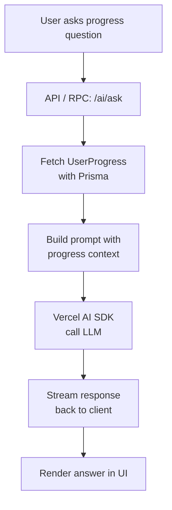

# AI Assistant Flow

```mermaid
flowchart TD
  UserQ["User asks progress question"]
    --> ApiAI["API / RPC: /ai/ask"]

  ApiAI --> FetchProgress["Fetch UserProgress<br/>with Prisma"]
  FetchProgress --> BuildPrompt["Build prompt with<br/>progress context"]
  BuildPrompt --> AISDK["Vercel AI SDK<br/>call LLM"]

  AISDK --> Stream["Stream response<br/>back to client"]
  Stream --> Render["Render answer in UI"]
```