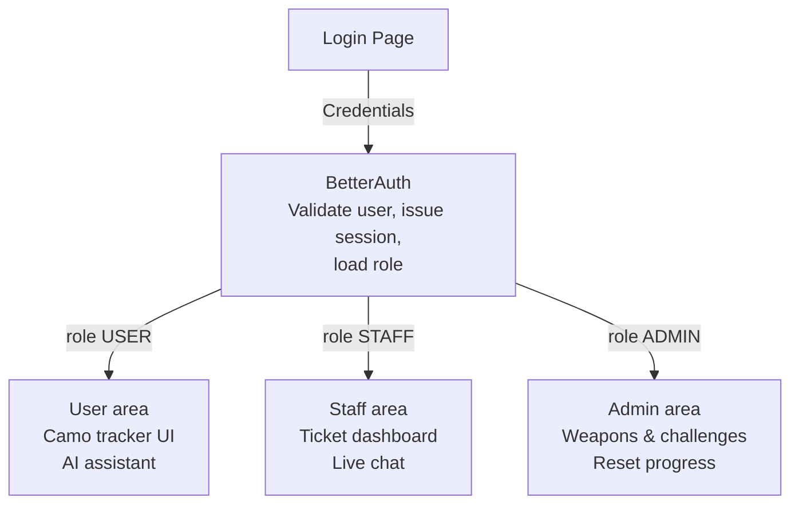

# Authentication & RBAC Flow

```mermaid
flowchart TD
  Login["Login Page"] -->|Credentials| Auth["BetterAuth<br/>Validate user, issue session,<br/>load role"]

  Auth -->|role USER| User["User area<br/>Camo tracker UI<br/>AI assistant"]
  Auth -->|role STAFF| Staff["Staff area<br/>Ticket dashboard<br/>Live chat"]
  Auth -->|role ADMIN| Admin["Admin area<br/>Weapons & challenges<br/>Reset progress"]
```