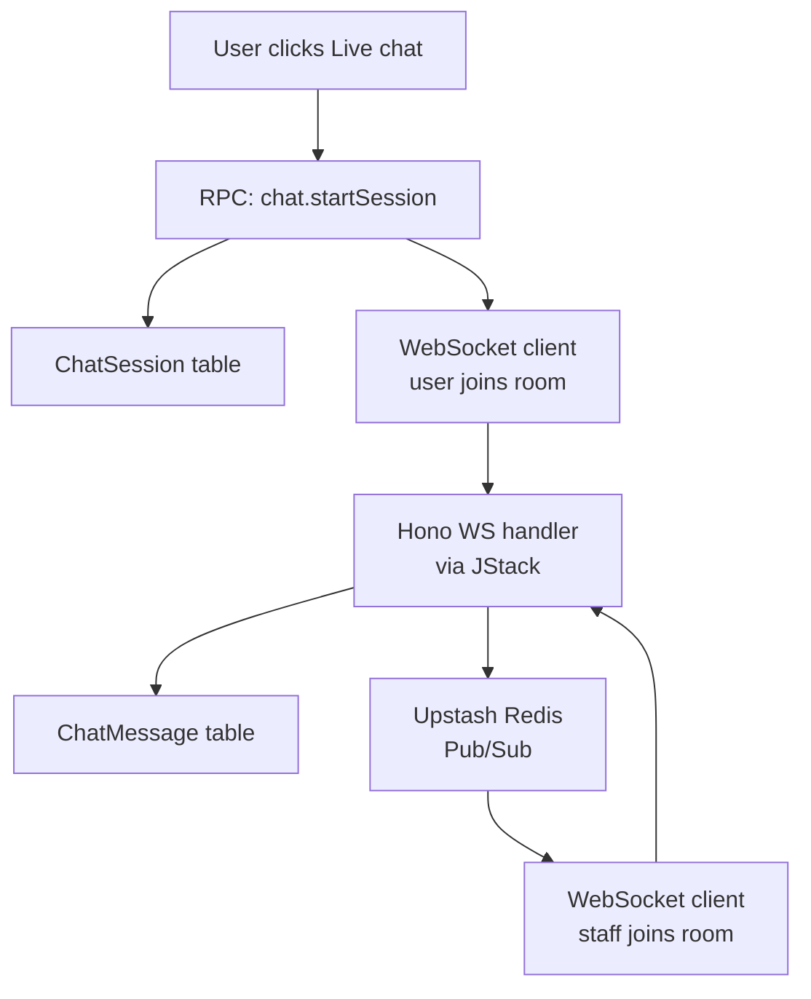

# Live Chat Support Flow

```mermaid
flowchart TD
  UserStart["User clicks Live chat"]
    --> RpcSession["RPC: chat.startSession"]

  RpcSession --> SessionDB["ChatSession table"]
  RpcSession --> WSUser["WebSocket client<br/>user joins room"]

  WSUser --> ServerWS["Hono WS handler<br/>via JStack"]
  ServerWS --> MsgDB["ChatMessage table"]
  ServerWS --> Redis["Upstash Redis<br/>Pub/Sub"]

  Redis --> WSStaff["WebSocket client<br/>staff joins room"]
  WSStaff --> ServerWS
```