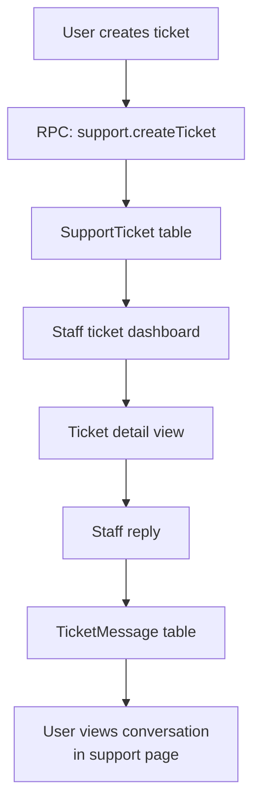

# Support Ticket Flow

```mermaid
flowchart TD
  UserCreate["User creates ticket"] --> RpcCreate["RPC: support.createTicket"]
  RpcCreate --> TicketDB["SupportTicket table"]

  TicketDB --> StaffDash["Staff ticket dashboard"]
  StaffDash --> TicketDetail["Ticket detail view"]

  TicketDetail --> Reply["Staff reply"]
  Reply --> MessageDB["TicketMessage table"]

  MessageDB --> UserView["User views conversation<br/>in support page"]
```