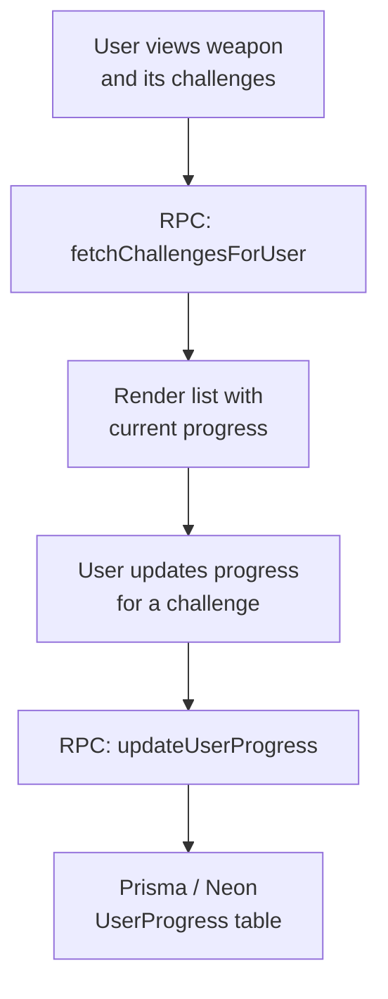

# User Progress Tracking

```mermaid
flowchart TD
  ViewWeapon["User views weapon<br/>and its challenges"]
    --> RpcFetch["RPC: fetchChallengesForUser"]

  RpcFetch --> UI["Render list with<br/>current progress"]

  UI --> Update["User updates progress<br/>for a challenge"]
  Update --> RpcUpdate["RPC: updateUserProgress"]

  RpcUpdate --> ProgressDB["Prisma / Neon<br/>UserProgress table"]
```