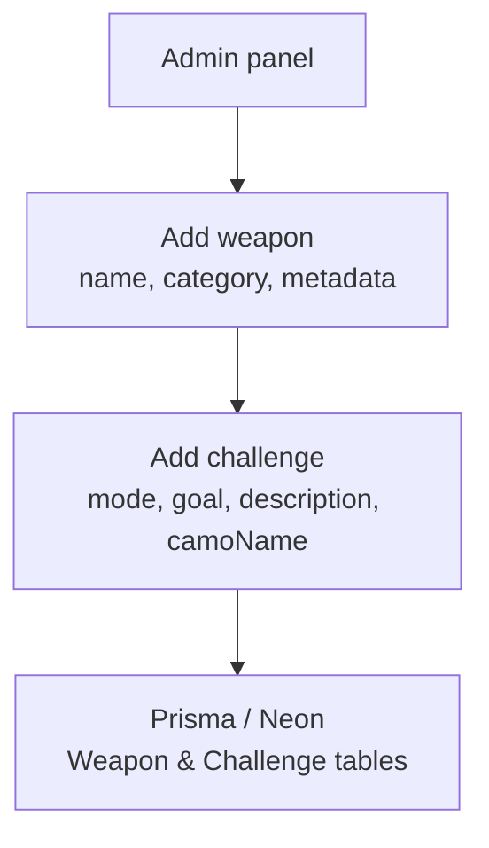

# Weapon & Challenge Management (Admin)

## Camo structure & unlock rules

- Each weapon has 9 Military camos, 3 Special camos, and 4 Mastery camos.
- Military camos must be completed in order (1-9) before Specials are available.
- All Specials must be completed to unlock Mastery 1 for that weapon.
- Mastery 2 unlock requires Mastery 1 on a set count per category:
  - SMG: 6, Assault Rifle: 7, Shotgun: 3, LMG: 2, Marksman Rifle: 3, Sniper Rifle: 3, Pistol: 3, Launcher: 2, Special: 2, Melee: 2.
- Mastery 3 unlock requires 30 weapons with Mastery 2.
- Mastery 4 unlock requires 30 weapons with Mastery 3.
- Camo names can differ per weapon and mode; Military names vary by mode, Specials/Mastery by weapon and mode.
